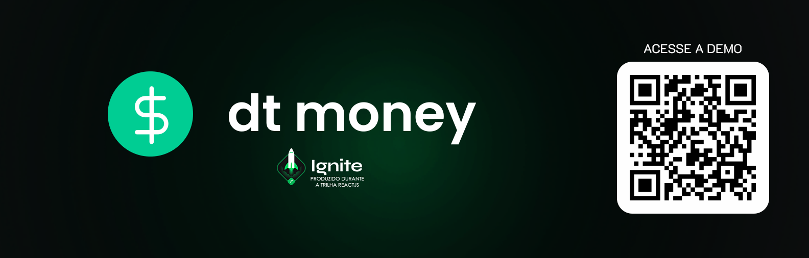
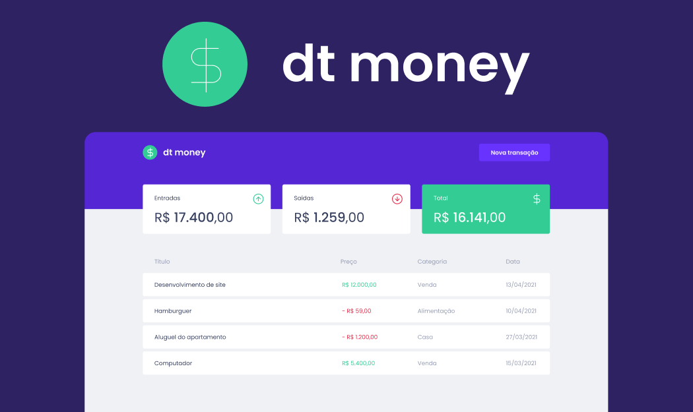

<div align="center" id="top"> 
  

  &#xa0;

  <!-- <a href="https://dtmoney.netlify.com">Demo</a> -->
</div>

<!-- <h1 align="center">Dt Money</h1> -->

<p align="center">
  
    
  
  
  

  
</p>

<h4 align="center"> 
	🚧  Em construção...  🚧
</h4> 


<p align="center">
  <a href="https://www.figma.com/file/0xmu9mj2TJYoIOubBFWsk5/dtmoney-Ignite-(Copy)?node-id=0%3A1">Layout</a> &#xa0; | &#xa0; 
  <a href="#dart-sobre">Sobre</a> &#xa0; | &#xa0; 
  <a href="#sparkles-funcionalidades">Funcionalidades</a> &#xa0; | &#xa0;
  <a href="#rocket-tecnologias">Tecnologias</a> &#xa0; | &#xa0;
  <a href="#white_check_mark-pré-requisitos">Pré requisitos</a> &#xa0; | &#xa0;
  <a href="#checkered_flag-começando">Começando</a> &#xa0; | &#xa0;
  <a href="#memo-licença">Licença</a> &#xa0; | &#xa0;
  <a href="https://github.com/thiilins" target="_blank">Autor</a>
  <br />
</p>
  <br />

<p align="center"></p>
  <br />

## :dart: Sobre ##
Aplicação desenvolvida durante o Chapter II da trilha de ReactJS.
Essa aplicação é destinada a facilitar o gerenciamento das finanças pessoais, permitindo a inserção de entradas, saidas e organizando tudo por categorias.
Nela trabalhamos com conceitos básicos do react como componentização, estado, hooks, etc. Além de trabalhar com consumo de API via axios, formulários dentro do ReactJS, Styled Components e suas funções entre outros conceitos e bibliotecas.
 &#xa0;

## :sparkles: Funcionalidades ##
- [x] Inserção de entradas/saidas
- [x] Cadastro de categorias
- [x] Calculo de total de entradas
- [x] Calculo de total de saídas
- [x] Calculo de Saldo Restante
 &#xa0;

## :rocket: Tecnologias ##

As seguintes ferramentas foram usadas na construção do projeto:

- [ReactJS](https://pt-br.reactjs.org/)
- [Node.js](https://nodejs.org/en/)
- [JavaScript](https://developer.mozilla.org/pt-BR/docs/Web/JavaScript)
- [TypeScript](https://www.typescriptlang.org/)
- [Styled Components](https://styled-components.com/)
- [Polished](https://polished.js.org/)
- [MirageJS](https://miragejs.com/)
 &#xa0;

## :white_check_mark: Pré requisitos ##

Antes de começar :checkered_flag:, você precisa ter o [Git](https://git-scm.com) e o [Node](https://nodejs.org/en/) instalados em sua maquina.
 &#xa0;

## :checkered_flag: Começando ##

```bash
# Clone este repositório
$ git clone https://github.com/thiilins/ignite-dt-money

# Entre na pasta
$ cd dt-money

# Instale as dependências
$ yarn

# Para iniciar o projeto
$ yarn start

# O app vai inicializar em <http://localhost:3000>
```
 &#xa0;

## :memo: Licença ##

Este projeto está sob licença MIT. Veja o arquivo [LICENSE](LICENSE.md) para mais detalhes.


Feito com :heart: por <a href="https://github.com/thiilins" target="_blank">Thiago Lins</a>

&#xa0;

<a href="#top">Voltar para o topo</a>
